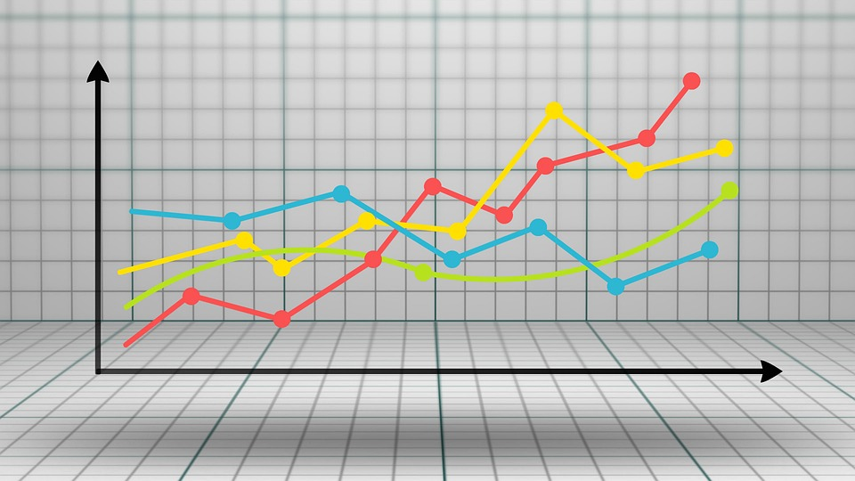
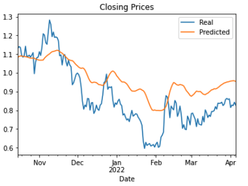
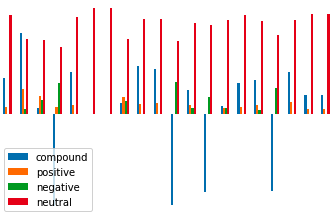
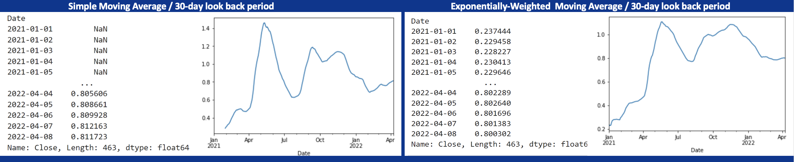
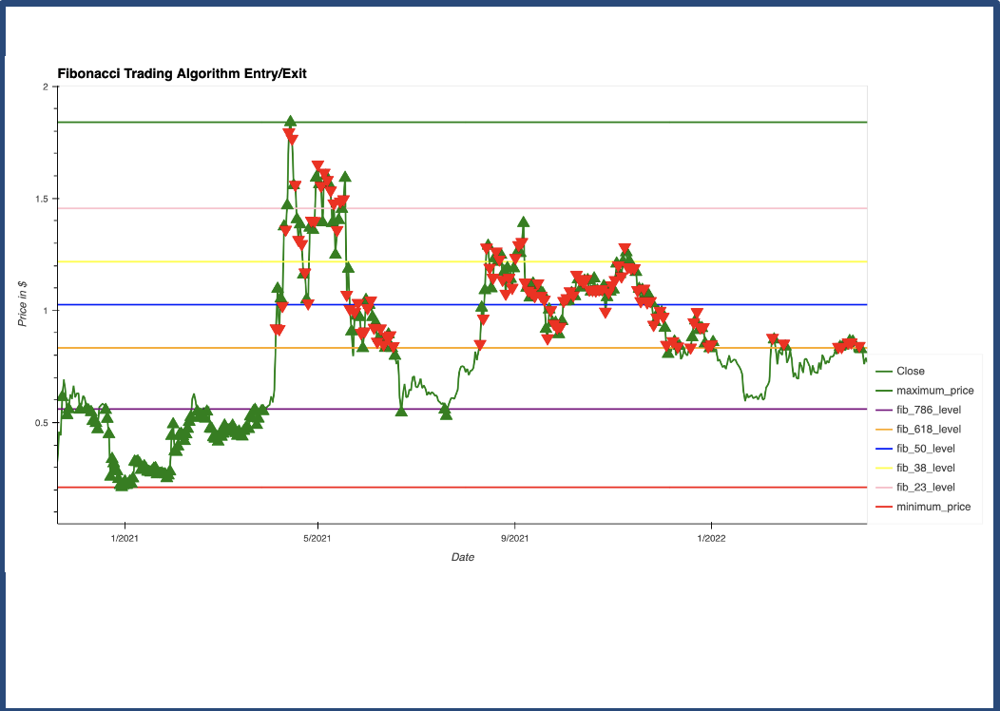

# Project_2_Ripple_Crypto_Price_Prediction_Models_and_Technical_Analysis
Repository for Project 2 in the Miami Fintech Bootcamp (Nov 2021) - Application of Machine Learning to solve a Fintech challenge

## Project #2 - Crypto Price Prediction & Technical Analysis
​
## Team Members:
    * Fabrice Salomon
    * Anthony Segovia
    * Josina Baiao
    * Clifford Charles
    * Chad Burford
​

​
# Background
​
Often, investers will use third party companies to provide financial information and advice for their investment desicions. This is definately the case when it comes to the Crypto Space, as there is a lot of unknown and investers may be new to this new asset class. We plan to build the following items in order to provide our investment advice within the Crypto Space:
1. Build a price predictive model that will provide an investor with the future price action of a particular crypto. For purposes of this project, we used Ripple (XRP) for our sample crypto for analysis.
2. Build indicators which will allow us to perform Technical Analysis and understand different entry and exit points and convey this advice to our investment clients.
​
# Project Goals
## Cryptocurrency Price Prediction and Technical Analysis
1. We will compare several machine learning models for predicting stock prices, volitility and sentiment for a given crypto currency. We will use past data to predict price for several days into the future.
* We will use yfinance to pull past ticker information
* We used the crypto currency Ripple (XRP) for purposes of this project
2. We also conduct Technical Analysis using a variety of indicators such as MACD, Bollinger Bands, Fibannoci Retracement and Rolling Averages.
3. Prepare a 10-15 minute presentation that demonstrates how machine learning can be used to solve problems in FinTech.
- - -
​
## Files
​
The following Jupyter Notebooks were used to build the Price Prediction Models and Indicators. 
​
Note: The notebooks show the final models used for the project, however, multiple features and variables were used to determine which models had the best performance.
​
* [Time-Series ARIMA & GARCH](Code_Files/Crypto_TimeSeries_Forecasting.ipynb)
​
* [Time-Series AutoTS](Code_Files/Crytpo_AutoTS_Forecasting.ipynb)
​
* [LSTM RNN Model](Code_Files/Crytpo_LSTM_Forecasting.ipynb)
​
* [Sentiment Analysis](Code_Files/sentiment_analysis.ipynb)
​
* [Bollinger Bands Indicator](Code_Files/bollinger.ipynb)
​
* [MACD & Fibonacci Indicators](Code_Files/MACD_and_Fibonacci_levels.ipynb)
​
* [Moving Averages](Code_Files/XRPewmaFinal.ipynb)
- - -
​
# Code Execution - Build Price Predictor and Indicators
​
## Time-Series Forecasting, Volitility, and Sentiment
1. ARIMA  - Used historical day close data pulled from Yahoo Finance, applied time series analysis and modeling to determine if there is a predictable behavior.
* Pulled in data, created a dataframe and ploted Date, Open, High, Low, Close, Adj Close, Volume.
* Trimmed data to September of 2020, and wrangled df in preperation for model.
* Imported ARIMA model fit it to the data.
* Output the results using arima_results.summary() and ploted. Determined the model was not confident in its predictions as the AIC & BIC were not very low at -1374.206 and the P factor was well above a confident score of 0.05 at a range of .238 to .773.
2. GARCH  - as a supplament of predicting price, we forecast near-term **volatility** of future Crypto price action. Being able to accurately predict volatility will be extremely useful if we want to provide investment advice for investers that trade in derivatives or quantify our maximum loss.
* Imported arch model
* We developed a GARCH model and fit it to the close data. Note: Setting parameters to p=2 and q=1: order=(2, 1).
* Output the GARCH summary table and take note of the p-values of the lags. Based on the p-values, is the model a good fit (p < 0.05)?
        * > alpha[1] was a .0575, which is good confidence in the model
        * > however, the AIC & BIC were high at 3585
* Plot the 5-day forecast of the volatility
3. LSTM - In this notebook, we build and train a custom LSTM RNN that uses a 7 day window of XRP closing prices to predict the 11th day closing price. 
* Prepare the data for training and testing
        > create a function that accepts the column number for the features (X) and the target (y)
        > defined X and y and determine feature and target column
        > split data into train and test sets for both X and y
        > used MinMaxScaler to scale data and then reshaped the features for the model
* Build and train a custom LSTM RNN
        > import tensorflow.keras.models for LSTM
        > set "model" variable to my Sequential() and used three Layers plus Output
        > compiled the model and summarized the model using model.summary()
        > Trained the data through 10 Epics with loss at 0.0128 at #10
* Evaluate the performance of the model
        > the y_test predictions had a loss of .0055
        > performed our prediction, recovered the original prices by using inverse_transform, and created a dataframe with Real and Predicted colums
        > ploted Real against Predicted results
        
4. AutoTS - AutoTS is a time series package for Python designed for rapidly deploying high-accuracy forecasts at scale. We used autoTS to predict a 10 day forecast of XRP.
* Import AutoTS and pull in data from yfinance and plot data
* Set autoTS model
        > use 10 day forecast length and dropped data older than 200 periods
        > fit the model to the data and run
        > predict the model and forecast 10 days - print results
        > plot predictions
* Check performance and accuracy of model with model.results and "validation" data.
3. Sentiment Analysis - we used natural language processing and text analysis, to systematically identify, extract, quantify, and study affective states and subjective information for XRP.
* Utilized Newsapi and imported NewsApiClient to capture text for analysis
* Utilized SentimentIntensityAnalyzer from nltk.sentiment.vader for analysis
  
    
## Indicators - Technical Analysis
1. Bollinger Band - TA indicator that is plotted at a standard deviation level above and below a simple moving average of the price
* Utilized Finta and their Technical Analysis module to build Bollinger Bands
* Used Yahoo Finance for data
2. Moving Average Convergence Divergence - a trend-following momentum indicator that shows the relationship between two moving averages of a security's price.
* Utilized Finta and their Technical Analysis module to build MACD
* Visualized the MACD indicator and set the signal column
* Developed the algorithm, tested it and evaluate
* Algo for XRP made a total profit/loss of the trading strategy of $1,647.05
 
    
3. Fibonacci Retracement - a method of technical analysis for determining support and resistance levels.
* Created a Fibonacci Signals dataframe looking at the actual return price, highest and lowest point and their difference
* Visualized the Fibonacci Levels and created a new function to "Implement Fibonacci Strategy"
* Created a "buy" and "sell" dataframe and split the data into a training and testing set
* Scaled the date using StandardScaler(), fit the model and run
* Created and ran model for XRP and made a total profit/loss of the trading strategy of $56,032.16
 
​
​
- - -
​
# Summary - Investment Recommendations
## Price Prediction
    1. All three models showed upward price predictions over the upcoming week
    2. The GARCH volitility model showed higher risk, but this is not uncommon in the crypto space
    3. The Sentiment Analysis showed relatively neutral, which is a positive signal, as crypto stocks have been in a down turn since November of 2021
## Technical Analysis 
    1. Analysis of the Moving Average indicators, we see an upward trend in XRP with the lower MA crossing up and over the higher MA around March 17th
    2. We also see the price action moving up past the Fibinacci 0.382 band and towards the 0.5 band, showing a bullish signal
    3. Lastly, the Bollinger Band analysis shows an upward trend but not breaking out above the high band. The band is trending slightly upward, but looks to be consolidating, which could be an indicator of a break up in price.
    
## Our XRP investment recommendation,  based on price prediction models and technical analysis, is a buy at this time
​
**this is for academic use only, NOT for specific investment advice**
​
